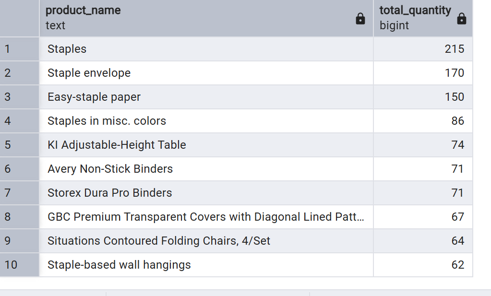
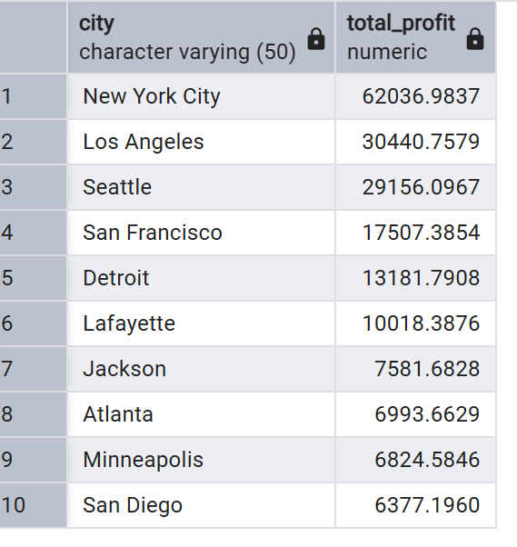
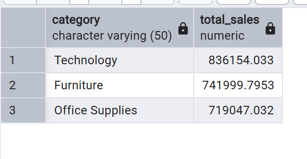
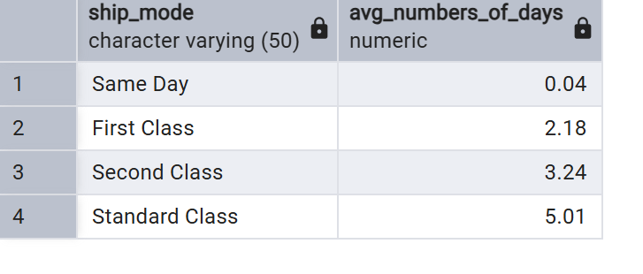
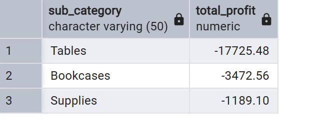
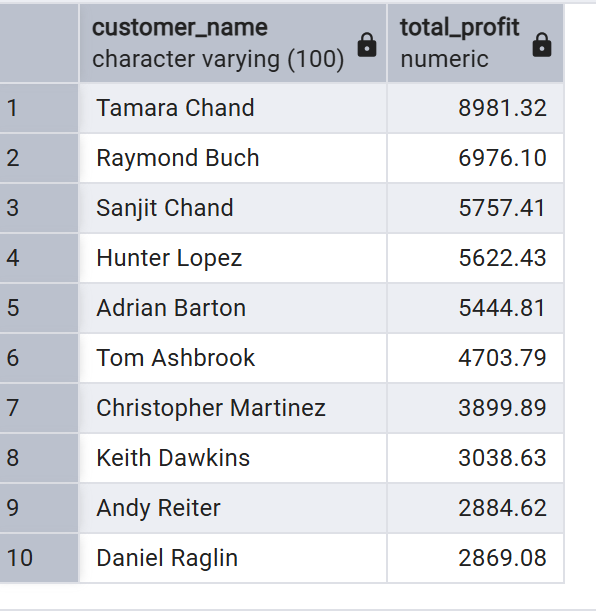

# sql-sales-analysis-project
# Retail Sales Analysis Using PostgreSQL 

## Project Overview

This project analyzes retail sales data using SQL and PostgreSQL to discover business insights related to sales, profit, customers, shipping, and product performance.

----

## Dataset
[Superstore Dataset](https://www.kaggle.com/datasets/vivek468/superstore-dataset-final/data)

## Tools Used

- PostgreSQL
- pgAdmin 4
- SQL

----

## SQL Skills Demonstrated

- GROUP BY
- ORDER BY
- Aggregate Functions
- HAVING
- CTE
- Data Analysis

----

## Key Insights

- Technology generated the highest total sales.
- New York City produced the highest total profit.
- Standard Class was the slowest shipping mode.
- Tables and Bookcases generated negative profit.
- Staples was the most sold product.

----

## Screenshots

### Top Products

### Top Profitable Cities

### Sales by Category

### Shipping Analysis

### Negative Profit Sub-Categories

### Top Customers by Profit

